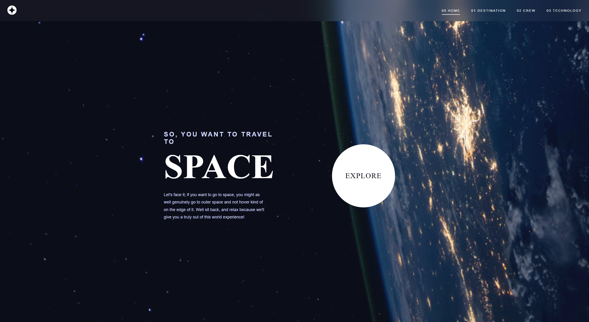

# Space Tourism Website

A multi-page space tourism website built with HTML, CSS, and JavaScript.
Inspired by the Frontend Mentor challenge.

## 🔗 Live Demo
[View Project](https://seu-link.vercel.app)

## 📸 Preview


## 🛠️ Built With
- HTML5 (semantic markup)
- CSS3 (Custom Properties, Flexbox, Grid)
- Vanilla JavaScript (ES6+)
- Fetch API for loading JSON data
- Mobile-first approach

## ✨ Features
- 4 pages: Home, Destination, Crew, Technology
- Tab navigation with dynamic content loading
- Fully responsive across all screen sizes
- Smooth transitions and animations
- Keyboard navigation (arrow keys between tabs)
- ARIA labels and screen reader support

## 🗂️ Pages
- **Home** — Welcome screen with explore CTA
- **Destination** — Moon, Mars, Europa, Titan with distance and travel time
- **Crew** — 4 crew members with roles and bios
- **Technology** — Launch Vehicle, Spaceport, Space Capsule

## 🚀 Getting Started

```bash
git clone https://github.com/thmendesdev/space-tourism.git
```
Open `index.html` in your browser — no dependencies required.

## 👨‍💻 Author
**Thiago Mendes** — Front-End Developer
- Portfolio: [portfolio-thiago-pied.vercel.app](https://portfolio-thiago-pied.vercel.app)
- LinkedIn: [linkedin.com/in/thiago-mendes-webdev](https://linkedin.com/in/thiago-mendes-webdev)